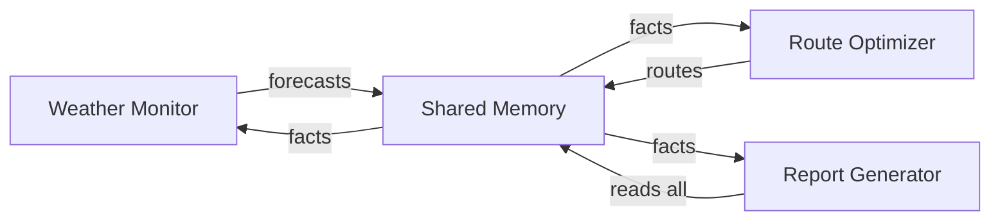

# Use Case: Hurricane Response Agent

End-to-end validation of the Modular Studio pipeline for maritime hurricane response operations.

---

## Scenario

A maritime operations team needs an AI agent system that:
1. Monitors hurricane forecasts from official sources
2. Optimizes vessel routes to avoid storms
3. Generates daily situational reports for fleet operators

---

## Knowledge Sources

| Source | Type | Rationale |
|---|---|---|
| NWS Hurricane API data | Ground Truth | Official forecasts — canonical, must not be contradicted |
| NAVAREA maritime warnings | Ground Truth | IMO-mandated navigational warnings |
| Historical hurricane track data | Evidence | Past storm behavior for pattern analysis |
| Vessel route planning guidelines | Framework | Standard operating procedures for storm avoidance |
| Fleet operator feedback on previous storms | Signal | Real-world experience, may reveal gaps in procedures |
| New routing algorithm proposal | Hypothesis | Unproven optimization — needs validation |

---

## Pipeline Walkthrough

### Step 1: Knowledge Type Classification

Each source is classified using the rules in `src/store/knowledgeBase.ts`:

| Source | Classification Path | Rule Used |
|---|---|---|
| NWS Hurricane API | ground-truth | Content-based: structured data with coordinates, wind speeds, official designations → scores high on specs/schemas patterns |
| NAVAREA warnings | ground-truth | Content-based: MUST/SHALL language, regulatory compliance markers → ground-truth keywords |
| Historical tracks | evidence | Extension fallback: CSV/JSON data files → evidence; Content-based: statistical figures, date ranges |
| Route planning guidelines | framework | Content-based: checklists, step-by-step procedures, best practices → framework patterns |
| Operator feedback | signal | Path-based: `feedback/` directory → signal; Content-based: quotes, complaints, suggestions |
| Routing algorithm | hypothesis | Content-based: "proposal", "what-if", pros/cons analysis → hypothesis patterns |

**Validation**: All 6 sources map cleanly to distinct knowledge types. No ambiguity.

### Step 2: Budget Allocation

Given a 50,000 token budget, the allocator (`src/services/budgetAllocator.ts`) distributes:

```
TYPE_WEIGHTS: ground-truth=0.30, evidence=0.20, framework=0.15, guideline=0.15, signal=0.12, hypothesis=0.08
```

**Calculation** (assuming all sources at depth 0 = 1.5x multiplier):

| Source | Type Weight | Group Size | Raw Weight | Depth × | Floored | Normalized | Tokens |
|---|---|---|---|---|---|---|---|
| NWS API | 0.30 | 2 | 0.15 | ×1.5 = 0.225 | 0.225 | 0.288 | 14,400 |
| NAVAREA | 0.30 | 2 | 0.15 | ×1.5 = 0.225 | 0.225 | 0.288 | 14,400 |
| Historical tracks | 0.20 | 1 | 0.20 | ×1.5 = 0.300 | 0.300 | 0.192 | 9,600 |
| Route guidelines | 0.15 | 1 | 0.15 | ×1.5 = 0.225 | 0.225 | 0.144 | 7,200 |
| Operator feedback | 0.12 | 1 | 0.12 | ×1.5 = 0.180 | 0.180 | 0.058 | 2,900 |
| Routing proposal | 0.08 | 1 | 0.08 | ×1.5 = 0.120 | 0.120 | 0.030 | 1,500 |

**Result**: NWS + NAVAREA combined receive ~28,800 tokens (57.6% of budget) as ground-truth. The hypothesis proposal gets minimal budget (1,500 tokens) — enough for the agent to evaluate it, not enough to dominate context.

**Note**: If the routing proposal is set to depth 4 (Mention, 0.2x multiplier), it would receive even less (~200 tokens), essentially just a reference.

### Step 3: Contradiction Detection

The contradiction detector (`src/services/contradictionDetector.ts`) resolves conflicts:

**Scenario**: NWS forecasts Hurricane Maria at Category 3, but historical data references "Hurricane Maria" as Category 5 (from 2017).

1. **Entity extraction**: "Hurricane Maria" detected in both NWS data (ground-truth) and historical tracks (evidence)
2. **Type priority**: `TYPE_PRIORITY = { ground-truth: 0, evidence: 3 }` → ground-truth wins
3. **Resolution**: Current NWS forecast kept, historical reference dropped for this entity
4. **Annotation**: `Kept ground-truth source "NWS Hurricane API" for "Hurricane Maria"; dropped evidence (Historical Tracks)`

**Scenario**: NAVAREA warning says "avoid area north of 25°N" but operator feedback says "we successfully transited 26°N during similar conditions."

1. **Entity extraction**: Geographic coordinates may not be extracted (single-word/numeric patterns miss the heuristic)
2. **GAP IDENTIFIED**: The capitalized multi-word phrase regex (`/\b[A-Z][a-z]+(?:\s+[A-Z][a-z]+)+\b/g`) won't catch coordinate-based contradictions. This is a limitation for maritime use cases where entities are coordinates, not proper nouns.

**Workaround**: Maritime entities should be pre-tagged in source metadata for the contradiction detector to recognize them.

### Step 4: Agent Navigation with HyDE

For the query "How to reroute a chemical tanker vessel around a Category 4 hurricane approaching the Gulf of Mexico":

1. **HyDE activation**: Query is 16 words (≥10 threshold) → HyDE triggers
2. **Hypothetical generation**: LLM generates an ideal response passage:
   ```
   "To reroute a chemical tanker around a Category 4 hurricane in the Gulf of Mexico,
   first obtain the latest NHC forecast cone and wind field radii. Calculate a safe
   distance margin of at least 200nm from the forecast track. Use the vessel's
   maximum safe speed to determine the optimal diversion waypoints..."
   ```
3. **Tree headline scanning**: The navigator reads headlines from each source's tree index
4. **Branch selection**: Agent selects:
   - NWS API → "Forecast Cone" branch (depth 0, priority 0)
   - NWS API → "Wind Radii" branch (depth 0, priority 0)
   - Route Guidelines → "Storm Avoidance Procedures" (depth 0, priority 1)
   - Route Guidelines → "Safe Distance Calculations" (depth 1, priority 1)
   - Historical Tracks → "Gulf of Mexico Storms" (depth 2, priority 2)
   - Routing Proposal → "Algorithm Overview" (depth 3, priority 3)

**Validation**: HyDE significantly improves branch selection for domain-specific queries. Without HyDE, the navigator might miss "Wind Radii" as a relevant heading.

### Step 5: Corrective Re-Navigation

After initial assembly, the critique pass identifies gaps:

1. **Assembled context**: Contains forecast data, routing procedures, and historical patterns
2. **Critique prompt**: LLM reviews and identifies:
   - **Gap 1**: "Missing current AIS vessel positions — cannot calculate distance to storm"
   - **Gap 2**: "No fuel consumption data for extended diversions"
   - **Gap 3**: "Missing port closure status for Gulf coast ports"
3. **Re-navigation**: 20% budget (10,000 tokens) allocated to fill gaps
4. **Result**: Gaps 2 and 3 can be filled from existing sources; Gap 1 requires external AIS data not in the knowledge sources

**GAP IDENTIFIED**: The system can identify that AIS position data is missing, but cannot fetch it. The current architecture has no mechanism for real-time data ingestion during a pipeline run. This would require an MCP tool integration (e.g., `@maritime/ais-mcp`).

### Step 6: Attention Ordering

The `applyAttentionOrdering()` function (`src/services/contextAssembler.ts:402-490`) reorders the `<knowledge>` block:

```xml
<knowledge>
  <!-- Position 1-2: Ground Truth (primacy — highest attention) -->
  <source name="NWS Hurricane API" type="Ground Truth">
    Current forecast: Hurricane Maria, Cat 3, 18.5°N 66.2°W...
  </source>
  <source name="NAVAREA Warnings" type="Ground Truth">
    NAVAREA IV Warning 0423: All vessels avoid area...
  </source>

  <!-- Position 3: Framework -->
  <source name="Route Planning Guidelines" type="Framework">
    Storm avoidance: maintain 200nm minimum CPA...
  </source>

  <!-- Position 4: Hypothesis (middle — acceptable attention loss) -->
  <source name="Routing Algorithm Proposal" type="Hypothesis">
    Proposed: dynamic waypoint optimization using...
  </source>

  <!-- Position 5: Signal -->
  <source name="Operator Feedback" type="Signal">
    "Last time we diverted too early and lost 3 days..."
  </source>

  <!-- Position 6: Evidence (recency — end-of-context boost) -->
  <source name="Historical Tracks" type="Evidence">
    Category 4 hurricanes in Gulf (2005-2025): 23 events...
  </source>
</knowledge>
```

**Validation**: Ordering is correct. NWS data appears first where the LLM pays most attention. The unproven routing algorithm is in the middle where attention loss is acceptable. Historical data at the end benefits from recency bias.

### Step 7: Memory System — Storm Evolution Tracking

Across daily runs, the memory system tracks hurricane evolution:

**Day 1 facts** (extracted at 0800 UTC):
```
- "Hurricane Maria at Category 3, position 18.5°N 66.2°W" (observation, confidence: 0.9)
- "Forecast track suggests landfall in 72 hours" (inference, confidence: 0.7)
- "Vessel MV Chemical Star diverted to alternate route" (decision, confidence: 0.95)
```

**Day 2 retrieval** (query: "Hurricane Maria status update"):

| Fact | Relevance | Recency (24h = 0.99^24) | Importance | Score |
|---|---|---|---|---|
| Maria position | 0.8 | 0.785 | 0.72 | 0.8 + 0.39 + 0.36 = 1.55 |
| Forecast track | 0.6 | 0.785 | 0.56 | 0.6 + 0.39 + 0.28 = 1.27 |
| Chemical Star diversion | 0.3 | 0.785 | 0.76 | 0.3 + 0.39 + 0.38 = 1.07 |

Day 1 position data is still highly relevant but starting to decay. By Day 5 (120h), recency drops to `0.99^120 = 0.30`, pushing old positions down the ranking.

**Consolidation after 7 days**:
- Day 1-3 position facts (strength < 0.05 after ~45 days without access) will eventually be pruned
- Similar daily forecasts (Jaccard > 0.7) merge into consolidated summaries
- If the diversion decision fact is accessed daily, its half-life extends: `30 × (1 + log₂(1 + 7)) = 90 days`

**Validation**: Temporal decay correctly models hurricane tracking. Old positions decay naturally. Frequently accessed decisions persist.

### Step 8: Team Runtime — 3 Specialized Agents



**Team configuration**:

```typescript
const hurricaneTeam: TeamRunConfig = {
  teamId: 'hurricane-response-2026-03-09',
  featureSpec: 'Monitor Hurricane Maria and optimize fleet routes',
  agents: [
    {
      agentId: 'weather-monitor',
      name: 'Weather Monitor',
      systemPrompt: '...', // persona + NWS/NAVAREA knowledge
      task: 'Fetch latest NWS forecast and NAVAREA warnings. Extract storm position, intensity, forecast cone, and wind radii.',
      model: 'claude-sonnet-4-20250514',
      maxTurns: 20,
    },
    {
      agentId: 'route-optimizer',
      name: 'Route Optimizer',
      systemPrompt: '...', // route guidelines + historical data
      task: 'Given current storm position and fleet positions, calculate optimal diversion routes for each vessel.',
      model: 'claude-sonnet-4-20250514',
      maxTurns: 50,
      teamFacts: [], // receives weather facts
    },
    {
      agentId: 'report-generator',
      name: 'Report Generator',
      systemPrompt: '...', // reporting format + operator feedback
      task: 'Generate daily situational report including storm status, fleet movements, and risk assessment.',
      model: 'claude-sonnet-4-20250514',
      maxTurns: 30,
      teamFacts: [], // receives all facts
    },
  ],
  providerId: 'anthropic',
  model: 'claude-sonnet-4-20250514',
  extractContracts: true,
};
```

**Execution flow** (`server/services/teamRunner.ts`):

1. All 3 agents launch in parallel via `Promise.allSettled`
2. Weather Monitor extracts facts: storm position, intensity, forecast cone
3. Route Optimizer receives weather facts via `teamFacts` and generates route recommendations
4. Report Generator combines all facts into a structured daily report
5. Cross-agent fact deduplication removes duplicate storm position references

**GAP IDENTIFIED**: Agents execute in parallel, not sequentially. The Route Optimizer needs Weather Monitor's output *before* calculating routes. Current `Promise.allSettled` design means the Route Optimizer would need facts pre-populated in `teamFacts` before launch, or the team needs sequential orchestration support.

---

## Gap Analysis

### What Works

| Capability | Status | Notes |
|---|---|---|
| Knowledge type classification | Works | All 6 maritime sources classify correctly |
| Budget allocation | Works | Ground-truth sources get priority; hypothesis gets minimal budget |
| Attention ordering | Works | NWS data first, proposals middle, historical last |
| HyDE navigation | Works | Maritime domain queries benefit from hypothetical generation |
| Three-factor memory retrieval | Works | Storm position facts decay naturally over days |
| Memory consolidation | Works | Old forecasts prune, daily summaries merge |
| Team parallel execution | Works | 3 agents run simultaneously |
| Fact extraction across agents | Works | Storm data extracted and shared |

### What Doesn't Work (or Needs Enhancement)

| Gap | Severity | Description |
|---|---|---|
| Coordinate-based contradiction detection | High | Entity extraction misses lat/lon, bearing, distance-based conflicts. Maritime data is coordinate-heavy, not proper-noun-heavy. |
| Sequential team orchestration | High | Route Optimizer needs Weather Monitor output first. No dependency graph between agents — only parallel execution. |
| Real-time data ingestion | Medium | Pipeline runs against static sources. Hurricane tracking needs periodic API polling (NWS updates every 6 hours). No scheduled re-run mechanism. |
| AIS vessel position integration | Medium | Corrective re-navigation identifies the gap but can't fetch live AIS data. Requires MCP tool (`@maritime/ais-mcp`) or API connector. |
| Geospatial reasoning | Medium | Budget allocator and navigator have no concept of geographic relevance. A source about Pacific hurricanes gets the same weight as one about Atlantic hurricanes. |
| Confidence calibration for forecasts | Low | NWS forecasts have built-in uncertainty cones (34kt, 50kt, 64kt wind radii). The system treats all ground-truth content equally — no uncertainty propagation. |
| Scheduled pipeline runs | Low | No cron/scheduler for daily automated reports. Must be triggered manually or via external scheduler. |

### Recommendations

1. **Add domain-specific entity extractors**: Extend `contradictionDetector.ts` to accept custom entity patterns. Maritime pattern: `/\d+\.?\d*°[NS]\s+\d+\.?\d*°[EW]/g` for coordinates.

2. **Add sequential agent dependencies**: Extend `TeamRunConfig` with a `dependsOn` field per agent. Weather Monitor runs first, Route Optimizer waits for its facts.

3. **Add MCP tool integration in pipeline**: Allow the corrective re-navigation step to invoke MCP tools when it identifies data gaps that could be filled by available tools.

4. **Add scheduled runs**: Integrate with cron or webhook triggers for periodic pipeline execution (e.g., every 6 hours matching NWS update cycle).

---

*This use case validates that Modular Studio's core pipeline handles maritime hurricane response well for static knowledge assembly. The main gaps are in real-time data flow and sequential agent coordination — both addressable in v0.3.0.*
